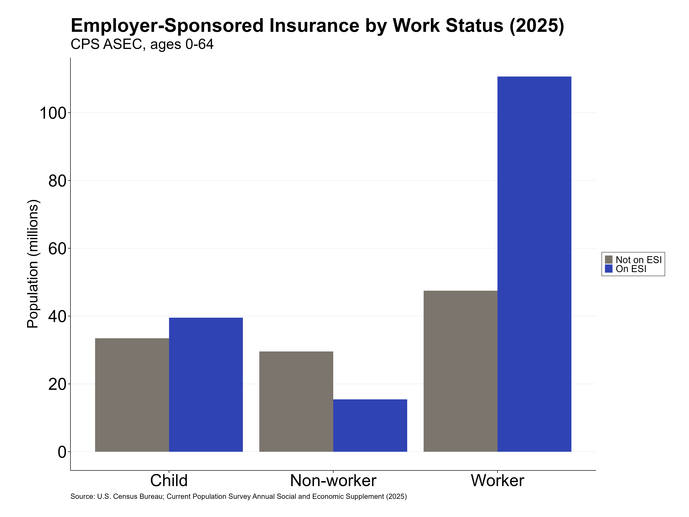

## Current Population Survey - Annual Social and Economic Supplements (2025) 
https://www.census.gov/data/datasets/time-series/demo/cps/cps-asec.html 
### How many non-elderly workers (aged 18-64) are on ESI.
- 110,681,349 adult workers are on ESI
- 15,446,728 adult non-workers are on ESI
- 39,520,250 children are on ESI

### How many non-elderly workers (aged 18-64) are on ESI from their own employer.
### How many non-elderly workers (aged 18-64) are on ESI from another family member (family plan).
### How many non-elderly workers (aged 18-64) were eligible for ESI and offered ESI from their employer but did not take it. (We call this group “decliners”)
### And crucially, how many “decliners” are on ESI from another family member.
